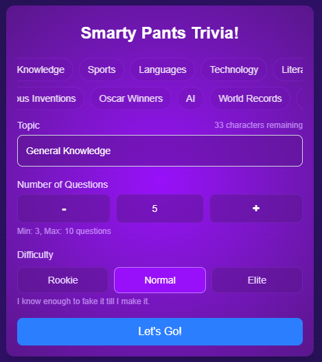
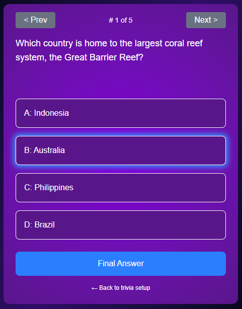
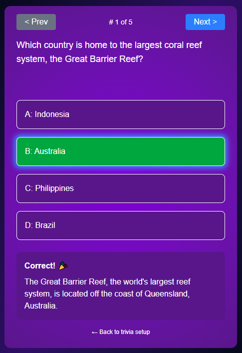
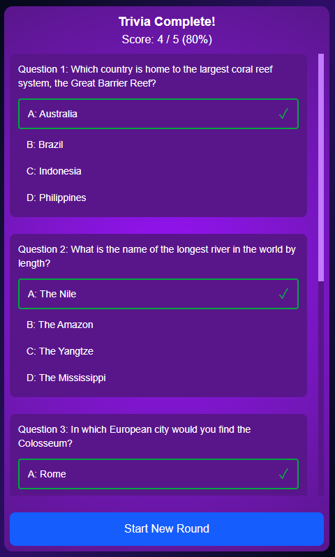

# Trivia App

A dynamic, web-based trivia application built with Next.js, React, and TypeScript, powered by LLMs.

Users can customize quiz sessions by selecting a topic and difficulty level. The app fetches questions on the fly using streaming LLM calls, tracks answers, provides immediate feedback, and summarizes results upon completion. After each game, users can email the trivia results via a separate n8n automation.

## Tech Stack

- Next.js
- React
- TypeScript
- Tailwind CSS
- OpenRouter API
- Zod for schema validation
- n8n for email automation

## Screenshots

